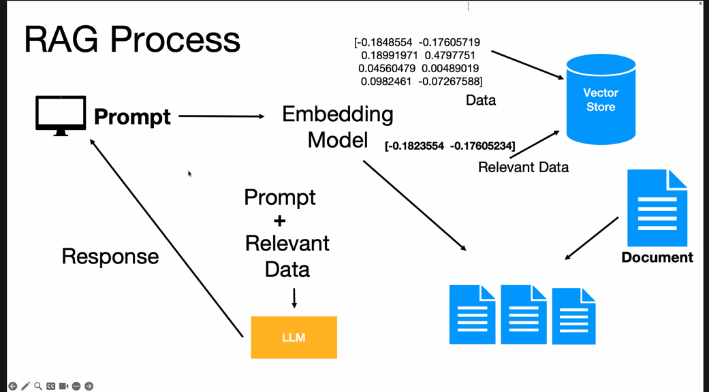

# 🔢 Embeddings

A self-contained module for working with embedding models across multiple
providers using LangChain. Covers vector generation, semantic search,
vector stores, and RAG (Retrieval-Augmented Generation).

---

## 📁 Folder Structure

```
embeddings/
├── app.py                    # Entry point — run this
├── embeddings_utils.py       # Provider-agnostic embedding factory
├── pipeline_utils.py         # Document loading + chunking shared utility
├── requirements.txt          # Embedding-specific dependencies
├── README.md                 # This file
├── data/
│   ├── text/                 # .txt files (job_listings.txt, science.txt ...)
│   └── pdfs/                 # .pdf files
└── pages/
    ├── home.py               # Landing page
    ├── embed_similarity.py   # Text similarity demo
    └── 08_chroma_job_search.py  # Semantic job search with ChromaDB
```

---

## 🚀 Getting Started

### Step 1 — Activate your virtual environment

```bash
cd LLM-Applications/langchain-learning/embeddings

# Mac / Linux
source ../.venv/bin/activate

# Windows
..\.venv\Scripts\activate
```

### Step 2 — Verify pip3 points inside your venv

On Intel Mac with PyCharm, `pip` may still point to the system Python
even when the venv is activated. Always check before installing:

```bash
which pip3    # ✅ should show .venv/bin/pip3
which python  # ✅ should show .venv/bin/python
which pip     # ⚠️  may show /usr/local/bin/pip — use pip3 instead
```

> **Rule for Intel Mac:** always use `pip3` (not `pip`) when your venv
> is active in PyCharm. `pip3` reliably points inside `.venv`.

### Step 3 — Install in the correct order (Intel Mac x86_64)

Order matters on Intel Mac due to the `onnxruntime` wheel limitation.
Run each command separately, not all at once:

```bash
# 1. Pin onnxruntime FIRST — versions >= 1.20 have no Intel Mac wheel
pip3 install "onnxruntime==1.19.2"

# 2. Install chromadb — finds onnxruntime already satisfied, won't upgrade
pip3 install chromadb

# 3. Install the LangChain wrapper for chromadb
pip3 install langchain-chroma

# 4. Install everything else
pip3 install -r requirements.txt

# 5. Install faiss without numba/llvmlite (they fail to build on Intel Mac)
pip3 install faiss-cpu --no-deps

# 6. Verify both vector stores work
python -c "import chromadb; import faiss; print('✅ Both working')"
```

**Apple Silicon (arm64) users** — simpler install:
```bash
pip3 install -r requirements.txt
pip3 install faiss-cpu --no-deps
python -c "import chromadb; import faiss; print('✅ Both working')"
```

### Step 4 — Run the app

```bash
streamlit run app.py
```

Open your browser at **http://localhost:8501**

---

## 🔑 Key System (`embeddings_utils.py`)

### How it works

Every user provides their own API key. The system checks in this order:

```
1. st.session_state  →  already entered this session (fast path)
2. Streamlit UI      →  provider + model dropdown + key input
```

Keys are stored **only** in `st.session_state` — never in `os.environ`.
`os.environ` is process-level and shared across all users on a server.

### Supported embedding providers

| Provider | Models | Dimensions | Key needed? |
|---|---|---|---|
| OpenAI | `text-embedding-3-small` | 1536 | ✅ |
| OpenAI | `text-embedding-3-large` | 3072 | ✅ |
| OpenAI | `text-embedding-ada-002` | 1536 | ✅ (legacy) |
| Google Gemini | `models/text-embedding-004` | 768 | ✅ |
| Google Gemini | `models/embedding-001` | 768 | ✅ |
| Cohere | `embed-english-v3.0` | 1024 | ✅ |
| Cohere | `embed-multilingual-v3.0` | 1024 | ✅ |
| Mistral | `mistral-embed` | 1024 | ✅ |
| HuggingFace (Local) | `all-MiniLM-L6-v2` | 384 | ❌ Free |
| HuggingFace (Local) | `all-mpnet-base-v2` | 768 | ❌ Free |

> ❌ **Anthropic** — Claude is chat-only. No embedding endpoint exists.
> ❌ **Groq** — Inference engine only. No proprietary embedding models.

---

## 📐 Core Concepts

### What is an embedding?

An embedding model converts text into a list of numbers (a **vector**) that
captures its semantic meaning. Similar texts produce vectors that are
mathematically close together.

```
"The cat sat on the mat"   →  [0.23, -0.81, 0.44, ...]   # 1536 numbers
"A feline rested on a rug" →  [0.22, -0.80, 0.43, ...]   # very similar!
"The stock market crashed"  →  [0.91,  0.14, -0.63, ...]  # very different
```

### Two key methods — same interface across all providers

```python
# Embed a single query string → returns one vector (list[float])
vector = embeddings.embed_query("What is LangChain?")

# Embed multiple documents → returns list of vectors (list[list[float]])
vectors = embeddings.embed_documents([
    "LangChain is a framework for LLM applications.",
    "Streamlit builds data apps in Python.",
])
```

---

## 📋 Usage Patterns

### Pattern 1 — Streamlit app (with UI auth)

```python
import streamlit as st
from embeddings_utils import get_or_set_embedding_key, build_embeddings

api_key, provider, model = get_or_set_embedding_key()
embeddings = build_embeddings(provider, model, api_key)

st.success(f"✅ Ready — **{provider}** · `{model}`")

user_text = st.text_input("Enter text to embed:")
if user_text:
    vector = embeddings.embed_query(user_text)
    st.write(f"Vector length: {len(vector)}")
```

### Pattern 2 — Plain Python script

```python
from embeddings_utils import build_embeddings
import os
from dotenv import load_dotenv

load_dotenv()
api_key = os.getenv("OPENAI_API_KEY")

embeddings = build_embeddings("OpenAI", "text-embedding-3-small", api_key)
vector = embeddings.embed_query("What is photosynthesis?")
print(f"Dimensions: {len(vector)}")   # → 1536
```

### Pattern 3 — One-liner shortcut

```python
from embeddings_utils import get_embeddings_from_session

embeddings = get_embeddings_from_session()
vector = embeddings.embed_query("hello world")
```

### Pattern 4 — Check dimensions before vector store setup

```python
from embeddings_utils import get_embedding_dimensions

dims = get_embedding_dimensions("OpenAI", "text-embedding-3-small")
# → 1536  — use this when creating a Pinecone index
```

### Pattern 5 — Both chat + embeddings in the same app

```python
from utils import get_or_set_api_key, build_llm
from embeddings_utils import get_or_set_embedding_key, build_embeddings

# Chat model (keys stored as "api_key", "provider", "model")
api_key, provider, model = get_or_set_api_key()
llm = build_llm(provider, model, api_key)

# Embedding model (keys stored as "embed_api_key", "embed_provider", "embed_model")
embed_key, embed_prov, embed_mod = get_or_set_embedding_key()
embeddings = build_embeddings(embed_prov, embed_mod, embed_key)
```

---

## 📂 Pipeline Utils (`pipeline_utils.py`)

Shared document loading and chunking used by all vector DB and RAG scripts.

### Loading functions

```python
from pipeline_utils import (
    load_text,          # single .txt from data/text/
    load_pdf,           # single .pdf from data/pdfs/
    load_all_texts,     # all .txt files in data/text/
    load_all_pdfs,      # all .pdf files in data/pdfs/
    load_all,           # everything combined
)

docs = load_text("job_listings.txt")    # → list[Document]
docs = load_pdf("report.pdf")           # → list[Document], one per page
docs = load_all_texts()                 # → all .txt files combined
docs = load_all()                       # → text + PDFs combined
```

### Chunking

```python
from pipeline_utils import chunk_documents

chunks = chunk_documents(docs, chunk_size=500, chunk_overlap=50)
# strategy="recursive"  → splits on \n\n → \n → " " → chars (default)
# strategy="character"  → splits only on \n\n
```

### One-liner convenience functions

```python
from pipeline_utils import (
    load_and_chunk_text,   # load one .txt + chunk
    load_and_chunk_pdf,    # load one .pdf + chunk
    load_and_chunk_all,    # load everything + chunk
    list_available_files,  # {"text": [...], "pdfs": [...]}
    summarise_chunks,      # stats dict: total, avg, min, max chars
)

chunks = load_and_chunk_text("science.txt")
chunks = load_and_chunk_all(chunk_size=300, chunk_overlap=30)

files = list_available_files()
# → {"text": ["job_listings.txt", "science.txt"], "pdfs": ["report.pdf"]}

stats = summarise_chunks(chunks)
# → {"total_chunks": 42, "avg_chars": 287, "min_chars": 112, ...}
```

---

## 🗄️ Vector Stores

### ChromaDB (local — easiest to start)

```python
from langchain_chroma import Chroma
from pipeline_utils import load_and_chunk_text
from embeddings_utils import build_embeddings

embeddings = build_embeddings("OpenAI", "text-embedding-3-small", api_key)
chunks     = load_and_chunk_text("job_listings.txt")

# In-memory (lost on restart)
vectorstore = Chroma.from_documents(chunks, embeddings)

# Persisted to disk (survives restarts)
vectorstore = Chroma.from_documents(
    chunks, embeddings, persist_directory="./chroma_db"
)

# Search
results = vectorstore.similarity_search("remote Python developer", k=4)
for doc in results:
    print(doc.page_content)
    print(doc.metadata)   # {"source": "...", "chunk": N}
```

### FAISS (local — fastest for large datasets)

```bash
# Install separately — must use --no-deps on Intel Mac
pip3 install faiss-cpu --no-deps
```

```python
from langchain_community.vectorstores import FAISS
from pipeline_utils import load_and_chunk_all
from embeddings_utils import build_embeddings

embeddings = build_embeddings("OpenAI", "text-embedding-3-small", api_key)
chunks     = load_and_chunk_all()

vectorstore = FAISS.from_documents(chunks, embeddings)

# Save / load
vectorstore.save_local("faiss_index")
vectorstore = FAISS.load_local(
    "faiss_index", embeddings, allow_dangerous_deserialization=True
)

results = vectorstore.similarity_search("your query", k=4)
```

---

## 🧠 RAG Pattern



```python
from langchain_chroma import Chroma
from langchain_core.prompts import ChatPromptTemplate
from langchain_core.runnables import RunnablePassthrough
from langchain_core.output_parsers import StrOutputParser
from pipeline_utils import load_and_chunk_all
from embeddings_utils import build_embeddings
from utils import build_llm

embeddings  = build_embeddings("OpenAI", "text-embedding-3-small", embed_key)
llm         = build_llm("Anthropic", "claude-sonnet-4-5", chat_key)
chunks      = load_and_chunk_all()
vectorstore = Chroma.from_documents(chunks, embeddings)
retriever   = vectorstore.as_retriever(search_kwargs={"k": 3})

prompt = ChatPromptTemplate.from_messages([
    ("system", "Answer using only this context:\n\n{context}"),
    ("human", "{question}"),
])

def format_docs(docs):
    return "\n\n".join(doc.page_content for doc in docs)

rag_chain = (
    {"context": retriever | format_docs, "question": RunnablePassthrough()}
    | prompt | llm | StrOutputParser()
)

answer = rag_chain.invoke("What Python jobs are available remotely?")
print(answer)
```

---

## ⚠️ Platform Notes (Intel Mac x86_64)

| Issue | Cause | Fix |
|---|---|---|
| `pip` installs to wrong Python | System `pip` vs venv `pip3` | Always use `pip3` in PyCharm venv |
| `onnxruntime` no wheel | Versions ≥ 1.20 dropped x86_64 | `pip3 install "onnxruntime==1.19.2"` first |
| `chromadb` not found | Installed into system Python | Use `pip3`, not `pip` |
| `llvmlite` build fails | Missing LLVM for numba | `pip3 install faiss-cpu --no-deps` |

**Golden rule for Intel Mac + PyCharm:**
```bash
# Always verify before installing anything
which pip3    # must show .venv/bin/pip3
which python  # must show .venv/bin/python

# Then use pip3 for every install
pip3 install <package>
```

---

## ➕ Adding a New Embedding Provider

Edit only `embeddings_utils.py`:

```python
# Step 1: add to EMBEDDING_PROVIDERS dict
"MyProvider": {
    "key_prefix":    "mp-",
    "env_var":       "MYPROVIDER_API_KEY",
    "models":        ["embed-v1"],
    "default_model": "embed-v1",
    "dimensions":    {"embed-v1": 768},
},

# Step 2: add to build_embeddings()
elif provider == "MyProvider":
    from langchain_myprovider import MyProviderEmbeddings
    return MyProviderEmbeddings(model=model, api_key=api_key)

# Step 3: add to pkg_map
"MyProvider": "langchain-myprovider",
```

---

## 📦 Dependencies

```
# Core
streamlit
python-dotenv
langchain / langchain-core / langchain-community
langchain-text-splitters

# Chat providers
langchain-openai / langchain-anthropic / langchain-google-genai
langchain-cohere / langchain-mistralai / langchain-groq

# Embedding providers
langchain-huggingface
sentence-transformers

# Platform pin — Intel Mac only
onnxruntime==1.19.2

# Document loaders
pypdf

# Vector stores
langchain-chroma
chromadb
# faiss-cpu  ← install separately: pip3 install faiss-cpu --no-deps

# Utilities
numpy
tiktoken
```

---

## 🗒️ Notes

- HuggingFace local models download on first use (~90MB for MiniLM) and cache locally — no internet needed after that.
- Always match your embedding model's dimensions to your vector store's index when using Pinecone or Weaviate.
- Use `text-embedding-3-small` as your default OpenAI model — it is significantly cheaper than `ada-002` and more accurate.
- `chroma_db/` and `faiss_index/` are auto-generated by ChromaDB/FAISS — add both to `.gitignore`.
- The `HISTORY` debug panel in Science Coach (`09_streamlit_history_chatprompttemplate.py`) is intentional for learning — remove it in production.
- For persistent memory across sessions, swap `StreamlitChatMessageHistory` for `RedisChatMessageHistory` or `SQLChatMessageHistory`.